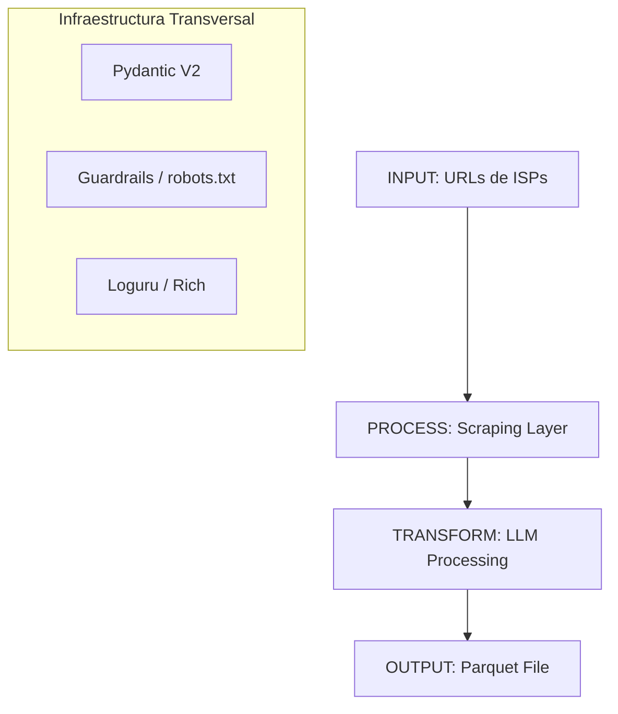

# Arquitectura y Decisiones de Diseño - Benchmark 360

## FASE 0 │ Fundamentos & Arquitectura de Decisión

### 0.1 Análisis del Dominio
El problema técnico radica en la dispersión, la heterogeneidad y el formato (HTML vs. Imágenes) de la información de los ISPs.

| PROBLEMA DE NEGOCIO | PROBLEMA TÉCNICO |
| :--- | :--- |
| Datos dispersos | Múltiples fuentes heterogéneas |
| Información en imágenes | No extraíble con HTML parser tradicional |
| Cambios frecuentes de oferta | El pipeline debe ser re-ejecutable y resiliente |
| 1400+ competidores | Sistema extensible a N scrapers |
| Precisión >95% | Validación estricta en tiempo de ejecución (Pydantic) |

### 0.2 Mapa Mental de Componentes


### 0.3 Decision Log (Registro de Decisiones Técnicas)

| DECISIÓN | ELECCIÓN | JUSTIFICACIÓN |
| :--- | :--- | :--- |
| **Gestor paquetes** | `uv` | Restricción del reto + 10-100x más rápido que pip. |
| **HTTP cliente** | `httpx` | Soporte async nativo, superior a requests. |
| **Browser automation**| `Playwright` | Más estable que Selenium, async nativo, evasión de WAF básico. |
| **Validación datos** | `Pydantic V2` | Requisito del jurado, validación de esquemas en milisegundos. |
| **Enrutamiento LLM** | `Fallback System` | OpenAI (`gpt-4o-mini`) primario -> Gemini (`2.5-flash`) respaldo. Resiliencia ante caídas de API o falta de saldo. |
| **LLM visión** | `gpt-4o` | Superior en extracción de tablas y texto en español desde imágenes promocionales. |
| **Formato de salida** | `Apache Parquet` | Requisito del reto + columnar, comprimido, óptimo para analítica. |
| **Logging** | `Loguru` | JSON serialize activado, thread-safe (enqueue), backtrace exhaustivo. |
| **Linter/formatter** | `Ruff` | PEP8 estricto + Google docstrings, ultra rápido. |

### 0.4 Análisis Previo de los ISPs

| ISP | Rendimiento JS | Contiene Imágenes Clave | Estrategia Base |
| :--- | :--- | :--- | :--- |
| **Netlife** | Alto | Sí | Playwright + Vision LLM |
| **Claro** | Alto | Sí | Playwright + Vision LLM |
| **CNT** | Medio | Ocasional | httpx -> fallback Playwright |
| **Xtrim** | Alto | Depende | Playwright |
| **Ecuanet** | Bajo | Raro | httpx + BeautifulSoup4 |
| **Puntonet** | Alto | Sí | Playwright + Vision LLM |
| **Alfanet** | Bajo | Raro | httpx + BeautifulSoup4 |
| **Fibramax** | Alto | Sí | Playwright + Vision LLM |

---

## Estrategia de Branching Git (Git Flow Adaptado)

Adoptamos una estrategia basada en **Git Flow** simplificada, ideal para un hackathon de alto rendimiento:

```text
main                           ← (Producción / Entrega Final)
│
└── develop                    ← (Rama de Integración Continua)
    ├── feature/setup          ← Fase 1 (Completada)
    ├── feature/models         ← Fase 2 (En Progreso)
    ├── feature/security       ← Fase 3
    ├── feature/scrapers       ← Fase 4
    │   ├── feature/scraper-netlife
    │   └── feature/scraper-... (Paralelizables)
    ├── feature/llm-processor  ← Fase 5
    ├── feature/normalizer     ← Fase 6
    ├── feature/pipeline       ← Fase 7
    ├── feature/parquet        ← Fase 8
    └── feature/tests          ← Fase 9
```
*Toda feature nace de `develop` y se hace merge hacia `develop` mediante Pull Requests.*
